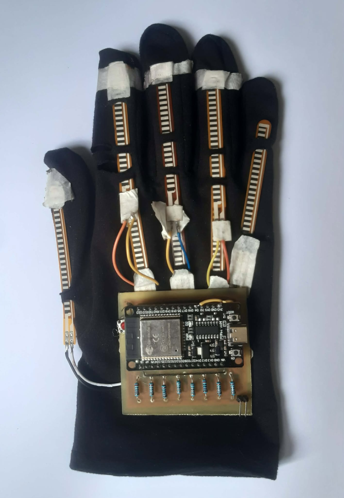
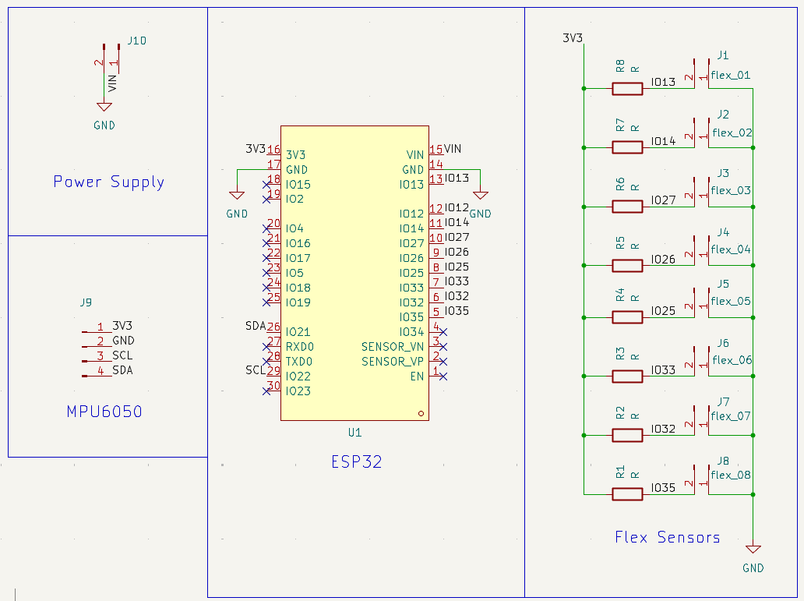

# Smart Glove for Real-Time Nepali Sign Language to Speech Translation


[](https://www.espressif.com/en/products/socs/esp32)
[](https://www.tensorflow.org/)

This repository contains the source code, hardware design files, datasets, and documentation for the **Smart Glove for Real-Time Nepali Sign Language (NSL) to Speech Translation** system. Developed as a final engineering project at Pashchimanchal Campus, Tribhuvan University, this wearable system translates static and dynamic Nepali Sign Language gestures into spoken audio output in real time to bridge the communication gap between the deaf/hard-of-hearing community and non-signers.

---

## Table of Contents
- [Abstract](#abstract)
- [System Architecture](#system-architecture)
- [Hardware & Software Requirements](#hardware--software-requirements)
- [Methodology](#methodology)
  - [Hardware Interfacing & Sensor Calibration](#hardware-interfacing--sensor-calibration)
  - [Data Collection & Dataset Preparation](#data-collection--dataset-preparation)
  - [Model Architecture & Training](#model-architecture--training)
  - [Real-Time Inference Pipeline](#real-time-inference-pipeline)
  - [Text-to-Speech (TTS) Integration](#text-to-speech-tts-integration)
- [Results and Discussion](#results-and-discussion)
  - [Real-Time Performance](#real-time-performance)
  - [Random Forest Analysis](#random-forest-analysis)
  - [LSTM Model Analysis](#lstm-model-analysis)
- [Video Demo](#video-demo)
- [Project Report](#project-report)
- [Appendix](#appendix)

---

## Abstract

Communication is essential, yet most non-signers in Nepal do not understand Nepali Sign Language (NSL). This project presents a wearable smart glove system integrating **8 flex sensors** (capturing joint flexion across MCP and PIP finger joints) and an **MPU6050 6-axis IMU** mounted on an **ESP32 microcontroller**. Sensor data is transmitted via Bluetooth to a host environment, where a dual machine learning model pipeline performs real-time classification:
- **Random Forest Classifier**: Handles 9 static gestures (4 alphabets: *ka, kha, ga, gha, nga* and 4 numerals: *ek, dui, tin, char*) with **99.56% test accuracy**.
- **2-Layer LSTM Network**: Processes 7 dynamic gestures (*namaste, mero, naam, sanjog, ho, malai, chinnu*) forming a basic self-introduction sequence, achieving **~94% validation accuracy**.

Across 320 real-time trials, the full system achieved an overall accuracy of **93.1%**, with average translation latencies of **0.5 seconds** for static gestures and **~2.0 seconds** for dynamic gestures.

---

## System Architecture

```
+-------------------------------------------------------------+
|                     WEARABLE SMART GLOVE                    |
|  [8x Flex Sensors (PIP/MCP Joints)]  [MPU6050 6-Axis IMU]   |
+------------------------------+------------------------------+
                               | Analog/I2C
                               v
+-------------------------------------------------------------+
|                     ESP32 MICROCONTROLLER                   |
|   - Signal Acquisition & Filtering                          |
|   - Feature Vector Assembly & Gyroscope Accumulation        |
+------------------------------+------------------------------+
                               | Bluetooth Serial Stream
                               v
+-------------------------------------------------------------+
|                      HOST COMPUTER                          |
|  +-------------------------------------------------------+  |
|  |             Motion Detection Logic                    |  |
|  |     (Rolling Buffer Gyro Variance Thresholding)       |  |
|  +---------------------------+---------------------------+  |
|                              |                              |
|              +---------------+---------------+              |
|              | Static                        | Dynamic      |
|              v                               v              |
|   +---------------------+         +---------------------+   |
|   | Random Forest Model |         | 2-Layer LSTM Model  |   |
|   |  (Static Gestures)  |         | (Dynamic Sequences) |   |
|   +----------+----------+         +----------+----------+   |
|              |                               |              |
|              +---------------+---------------+              |
|                              | Predicted Label              |
|                              v                              |
|   +-----------------------------------------------------+   |
|   |         Pre-generated Nepali Audio Retrieval        |   |
|   |                 (gTTS / MP3 Playback)               |   |
|   +--------------------------+--------------------------+   |
+------------------------------|------------------------------+
                               v
                     (( Speaker Output ))
```

---

## Hardware & Software Requirements

### Hardware Components
- **ESP32 Microcontroller**: Dual-core SoC handling ADC acquisition, I2C IMU sampling, and Bluetooth RFCOMM streaming.
- **Flex Sensors (x8)**: Variable bend-resistors positioned across finger joints (2.2" and 4.5" strips).
- **MPU6050 IMU**: 3-axis accelerometer + 3-axis gyroscope for hand orientation and motion tracking.
- **Resistors**: $20	\text{ k}\Omega$ precision fixed series resistors for flex sensor voltage dividers.
- **Audio Output Device**: Speaker/headphones connected to the host system.

### Software & Libraries
- **Firmware**: C++ / Arduino Framework deployed via **PlatformIO** / **VS Code**.
- **Data Processing & ML/DL**: Python 3.x, `NumPy`, `Pandas`, `Scikit-Learn`, `TensorFlow / Keras`.
- **Text-to-Speech**: `gTTS` (Google Text-to-Speech) library.
- **Hardware CAD**: KiCad EDA for schematic capture and PCB layout.

---

## Methodology

### Hardware Interfacing & Sensor Calibration
- **Flex Sensor Placement**: 8 flex sensors are mapped to capture fine-grained finger articulation:
  - **Index, Middle, Ring Fingers**: 2 sensors per finger—one across the Proximal Interphalangeal (PIP / "Up") joint and one across the Metacarpophalangeal (MCP / "Low") joint (`idxUp`, `idxLow`, `midUp`, `midLow`, `ringUp`, `ringLow`).
  - **Thumb & Pinky**: 1 sensor each (`thumb`, `pinky`).
- **Voltage Divider Optimization**: Flex resistance ranges from $\sim 20	\text{ k}\Omega$ (flat) to $\sim 24	\text{ k}\Omega$ (bent). Connecting a $20	\text{ k}\Omega$ series resistor ($R_2$) maximizes the ADC voltage differential to optimize 12-bit ADC sensitivity.
- **Sensor Calibration**: Physical conditioning (15–20 fist flexes) redistributes sensor conductive ink before use. At startup, the system captures 100 baseline idle samples to compute per-sensor zero offsets.

### Data Collection & Dataset Preparation
Sampling is executed at **60 ms intervals**. Each feature vector consists of 17 parameters:
$$\mathbf{x} = \left[ \text{idxUp}, \text{idxLow}, \text{midUp}, \text{midLow}, \text{ringUp}, \text{ringLow}, \text{thumb}, \text{pinky}, a_x, a_y, a_z, g_x, g_y, g_z, \text{acc\_g}_x, \text{acc\_g}_y, \text{acc\_g}_z \right]$$

- **Static Dataset**: 1000 samples per gesture across 9 gestures = **9,000 labeled samples** (`.csv` format). Dynamic gyro parameters were excluded during static training.
- **Dynamic Dataset**: Motion detection uses a 20-sample rolling buffer tracking accumulated gyroscope variances ($\Delta 	\text{acc\_g}$). A threshold $> 20$ triggers active recording, terminating after 7 consecutive static samples. 200 raw sequences per gesture were recorded and expanded to **1,500 samples per gesture** via white-noise data augmentation. All sequences were resampled to a fixed length of **70 frames** using linear interpolation.

---

### Model Architecture & Training

1. **Static Gestures (Random Forest Classifier)**
   - Input scaled via `StandardScaler`. Hyperparameters tuned using `GridSearchCV`.
   - **Configuration**: `n_estimators=30`, `max_samples=0.70`, Train/Test Split: 70/30.
   
2. **Dynamic Gestures (LSTM Network)**
   - $(70 \text{ frames} \times 15 \text{ features})$, normalized via `MinMaxScaler`.
   - **Architecture**: 2-layer stacked LSTM (16 hidden units per layer), Dropout rate $= 0.5$, Batch size $= 32$, Adam optimizer, Categorical Cross-Entropy loss.
   - **Early Stopping**: Monitored validation loss with a patience of 10 epochs.

---


### Real-Time Inference Pipeline
1. ESP32 streams sensor vectors via Bluetooth RFCOMM.
2. Host Python script buffers incoming frames and evaluates gyroscope variance:
   - **Low Variance ($\le 20$)**: Routes current frame to Random Forest (`.joblib`) $
ightarrow$ Output static gesture.
   - **High Variance ($> 20$)**: Accumulates sequence frame buffer $
ightarrow$ Interpolates to 70 frames $
ightarrow$ Feeds into LSTM (`.h5`) $
ightarrow$ Output dynamic gesture.

### Text-to-Speech (TTS) Integration
Predicted labels map to pre-synthesized Devanagari audio files generated via the `gTTS` library. The system executes immediate audio playback upon gesture classification completion.

---

## Results and Discussion

### Real-Time Performance
The complete hardware-software system was evaluated across **320 real-time trials** (20 trials per gesture across 16 gestures).

| Gesture Class | Gesture Type | Correct | Incorrect | Accuracy (%) |
| :--- | :--- | :---: | :---: | :---: |
| **Namaste** | Dynamic | 15 | 5 | 75.0% |
| **Mero** | Dynamic | 16 | 4 | 80.0% |
| **Naam** | Dynamic | 20 | 0 | 100.0% |
| **Sanjog** | Dynamic | 18 | 2 | 90.0% |
| **Ho** | Dynamic | 20 | 0 | 100.0% |
| **Malai** | Dynamic | 18 | 2 | 90.0% |
| **Chinnu** | Dynamic | 19 | 1 | 95.0% |
| **ek (1)** | Static | 19 | 1 | 95.0% |
| **dui (2)** | Static | 20 | 0 | 100.0% |
| **tin (3)** | Static | 20 | 0 | 100.0% |
| **char (4)**| Static | 17 | 3 | 85.0% |
| **ka** | Static | 20 | 0 | 100.0% |
| **kha** | Static | 20 | 0 | 100.0% |
| **ga** | Static | 18 | 2 | 90.0% |
| **gha** | Static | 18 | 2 | 90.0% |
| **nga** | Static | 20 | 0 | 100.0% |
| **OVERALL** | **System Total** | **298** | **22** | **93.1%** |

- **Average Static Latency**: $\sim 0.5 	\text{ seconds}$
- **Average Dynamic Latency**: $\sim 2.0 	\text{ seconds}$

### Random Forest Analysis
- **Training Accuracy**: 99.94%
- **Testing Accuracy**: 99.56%
- **Out-Of-Bag (OOB) Score**: 99.62%

The minimal delta between training and test metrics confirms high model generalization with minimal risk of overfitting.

### LSTM Model Analysis
- **Validation Accuracy**: Stabilized at $\sim 94\%$.
- **Temporal Importance Analysis**: Feature importance evaluation revealed that the network heavily weights the final sequence steps (frames 66–69), focusing on "ending signatures." This temporal weighting explains occasional misclassifications between gestures with similar trajectory endings (e.g., *mero* vs. *namaste*). Future work will incorporate **Attention Mechanisms** or **Bidirectional LSTMs (BiLSTM)** to distribute importance evenly across full trajectories.

---

## Video Demo

An end-to-end video demonstration showing real-time sign recognition, dual-model inference switching, and instant audio vocalization is available below:

[Watch Demo Video](docs/demo.mp4)


---

## Project Report

The complete academic major project report submitted to the Department of Electronics and Computer Engineering, Pashchimanchal Campus, IOE, Tribhuvan University, is included in this repository:

📄 **[Download Full Major Project Report (PDF)](docs/Major_Project_Report.pdf)**

---

## Appendix

### Prototype Smart Glove
Physical wearable prototype featuring 8 integrated flex sensors, custom wiring harness, and glove-mounted ESP32/MPU6050 enclosure.



---

### Custom PCB Schematic
KiCad EDA PCB schematic showing power regulation, ESP32 ADC pin routing for flex sensor voltage dividers, and I2C lines for MPU6050.



---

## Authors & Acknowledgments
**Project Team (PAS078BEI Batch):**
- [Ganesh Rokaya](https://github.com/Torngt) (PAS078BEI013)
- [Sanjog Sapkota](https://github.com/Sanjog34) (PAS078BEI034)
- [Santosh Kumar Barai](https://github.com/Skbarai) (PAS078BEI035)
- [Upendra Raj Joshi](https://github.com/Upendra48) (PAS078BEI046)

**Supervisor:** Asst. Prof. Khem Raj Koirala  
**Department:** Department of Electronics and Computer Engineering, Pashchimanchal Campus, IOE, Tribhuvan University.
