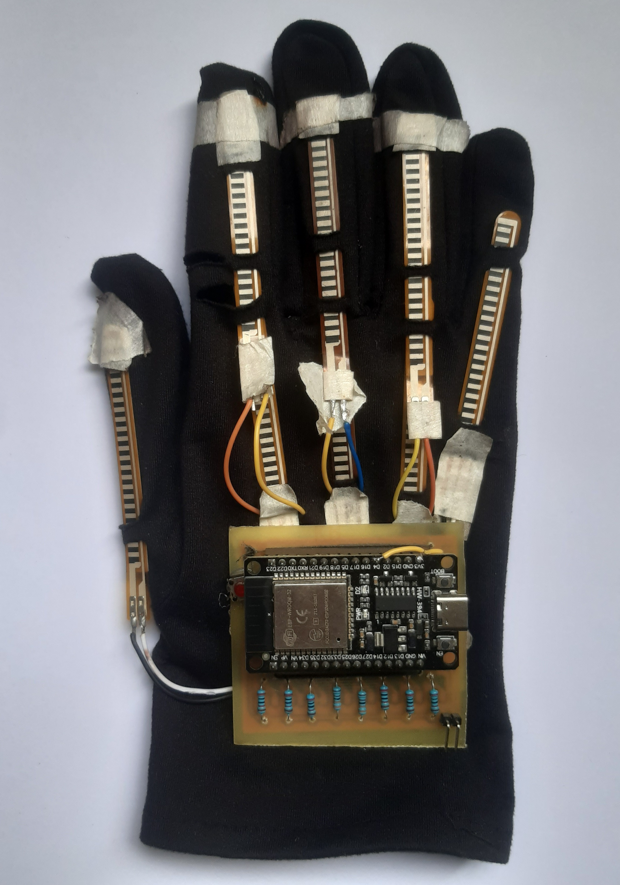

This project presents a smart glove system for real-time Nepali Sign Language recognition and speech translation using flex sensors and an MPU6050 IMU. The glove captures finger bending, hand orientation, and motion data to recognize both static and dynamic gestures in real time. To improve recognition performance for different types of
gestures, two separate models are implemented. A Random Forest classifier is used for static gesture recognition due to its efficiency with small and structured sensor datasets,
while an LSTM-based deep learning model is used for dynamic gesture recognition
to effectively learn temporal motion patterns from sequential sensor data. The recognized gestures are converted into speech by playing pre-generated audio files created
using a text-to-speech system and stored locally for real-time playback. Although the
current implementation demonstrates translation for a limited vocabulary set, the system provides a wearable, low-cost, and practical foundation for real-time sign language translation.

  

